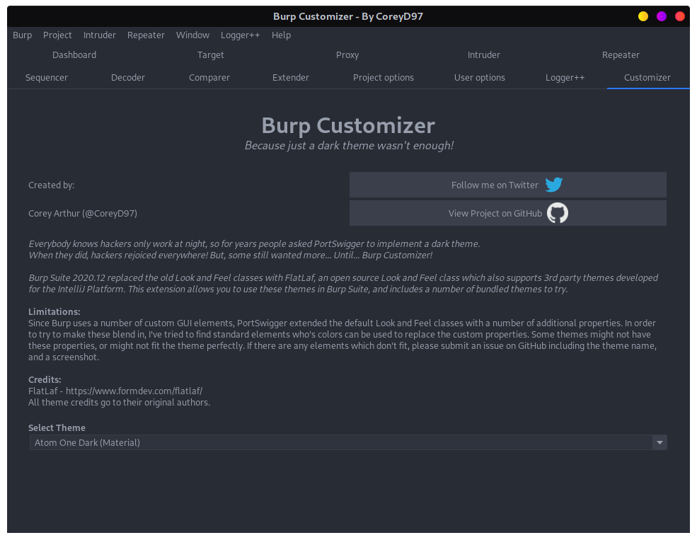
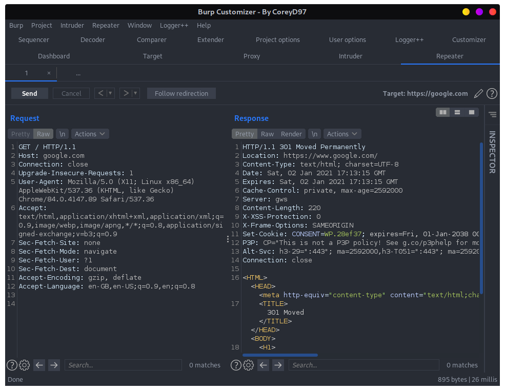
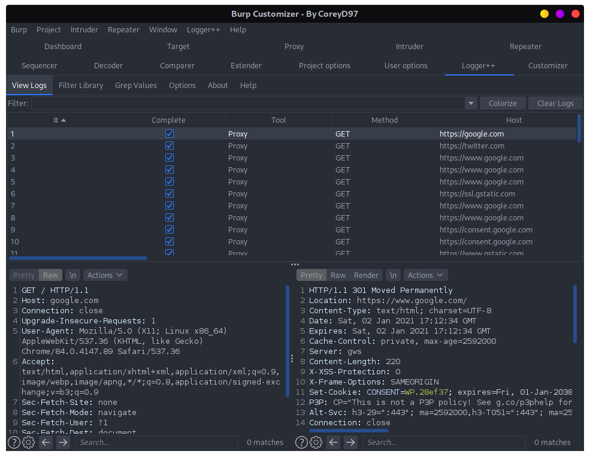
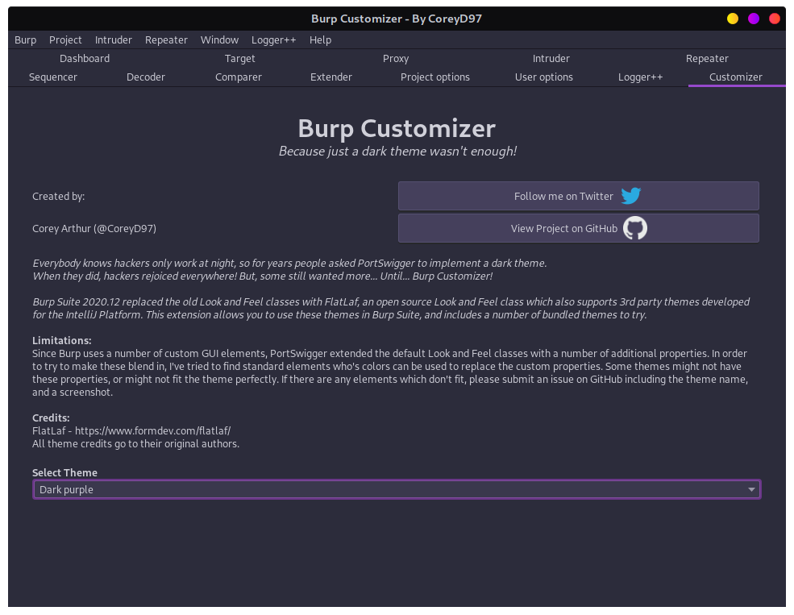
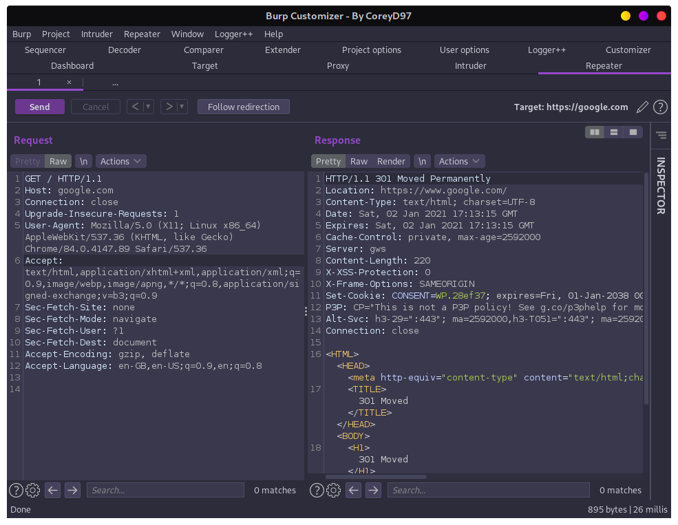
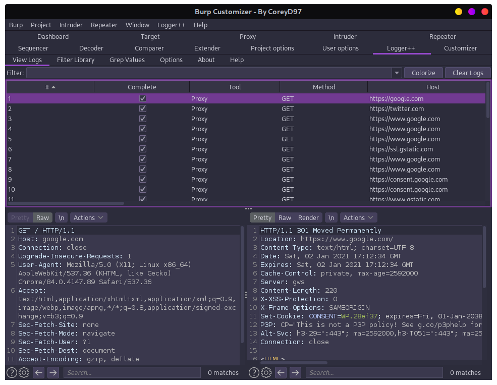

# BurpExtensions
On the way to collect BurpExtensions

## fakeIP

服务端配置错误情况下用于伪造ip地址进行测试的Burp Suite插件

- 伪造指定ip
- 伪造本地ip
- 伪造随机ip
- 随机ip爆破

**Github地址：** https://github.com/TheKingOfDuck/burpFakeIP


## Chunked coding converter

本插件主要用于分块传输绕WAF，不了解分块传输绕WAF的请参考下述文章。

- [利用分块传输吊打所有WAF](https://www.anquanke.com/post/id/169738)
- [在HTTP协议层面绕过WAF](https://www.freebuf.com/news/193659.html)
- [编写Burp分块传输插件绕WAF](https://mp.weixin.qq.com/s?__biz=Mzg3NjA4MTQ1NQ==&mid=2247483787&idx=1&sn=54c33727696f8ee6d67f997acc11ab89&chksm=cf36f9cbf84170dd7da9b48b3365fb05d7ccec6bdeff480d0c38962f712e400a40b2b38dc467&token=360242838&lang=zh_CN#rd)
- [Java反序列化数据绕WAF之延时分块传输](https://gv7.me/articles/2021/java-deserialized-data-bypasses-waf-through-sleep-chunked/)

**Github地址：** https://github.com/c0ny1/chunked-coding-converter


## BurpCustomizer

新版burp皮肤切换插件，自带几十种皮肤（仅支持2020.12及以上版本的burp）

**Images:**

<table>
<tr><td>Atom One Dark</td>
<td>

</td>
<td>


</td>
<td>


</td></tr>
<tr><td>Dark Purple</td>
<td>


</td>
<td>


</td>
<td>


</td></tr>
<tr>
<td colspan="4" align="right">And 56 more themes!</td>
</tr>
</table>

**Github地址：** https://github.com/CoreyD97/BurpCustomizer


## BurpShiroPassiveScan

一款基于BurpSuite的被动式shiro检测插件，可以节省一些渗透时间更好地进行划水。

该插件会对BurpSuite传进来的每个不同的域名+端口的流量进行一次shiro检测

目前的功能如下

- shiro框架指纹检测
- shiro加密key检测,cbc,gcm

**Github地址：** https://github.com/pmiaowu/BurpShiroPassiveScan


## Passive Scan Client

Burp被动扫描流量转发插件

```
Q1: 将浏览器代理到被动扫描器上，访问网站变慢，甚至有时被封ip，这该怎么办？
Q2: 需要人工渗透的同时后台进行被动扫描，到底是代理到burp还是被动扫描器？
Q3: ......
```

该插件正是为了解决该问题，将`正常访问网站的流量`与`提交给被动扫描器的流量`分开，互不影响。


**Github地址：** https://github.com/c0ny1/passive-scan-client